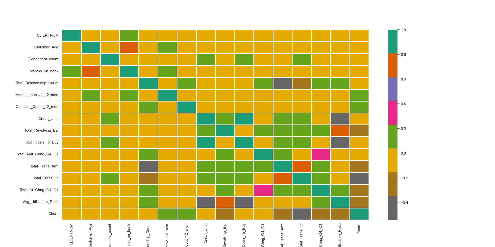
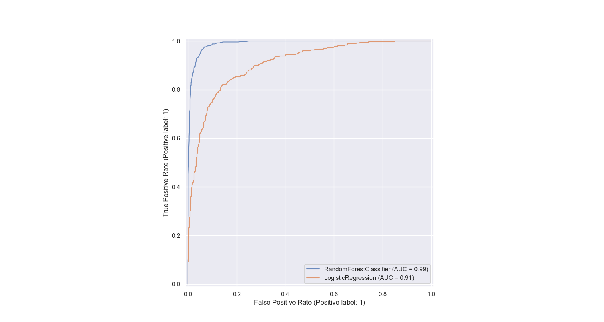
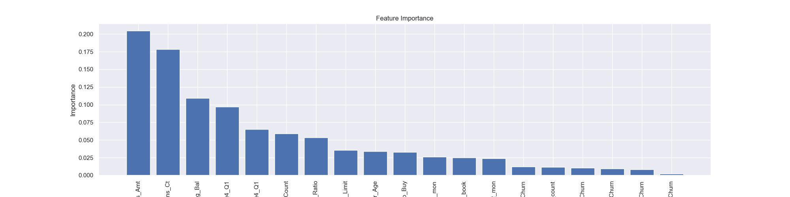

# Predict_Customer_Churn
Project for Udacity ML Dev Ops Nanodegree that produces production ready code.

## Project Description
This project is part of Udacity’s Machine Learning DevOps Engineer Nanodegree. The objective is to develop production-ready, clean code. for a model that predicts banking customer churn. This is a binary classification problem. Below is the proposed approach:

- Data Exploration and Analysis (EDA): We load and explore a dataset containing over 10,000 samples.
- Data Preparation: We perform feature engineering, resulting in 19 relevant features for training.
- Model Training: We train two classification models: a random forest using Scikit-Learn and a logistic regression model.
- Score: We use Area Under The Curve (AUC) scores to evaluate the best models and store the AUC score, precision, recall, F1, and accuracy metrics in a log file. 
- Feature Importance Visualization: We identify the most influential features impacting predictions and visualize their effects using the SHAP library and also produce a Feature Importance visual.
- Model Persistence: We save the best-performing models.

The Python scripts (.py files) have been adjusted to adhere to the PEP8 coding standard using the autopep8 module. We also run pylint analysis on these files. We write to logs during the running of both the churn_library.py and the churn_script_logging_and_tests.py using a common logging function which we import.

## Folders and Files

Directory Structure:
- Folders
    - artifacts      
        - coef_list.txt       --> correlations of churn to all columns used for the modelling process
    - data      
        - bank_data.csv       --> input data
        - train test splits   --> X_test, X_train, y_test, y_train
    - images       
         - eda                --> histograms, correlation heat map, and bar chart
         - results            --> classification reports, roc_auc plots, feature importance, and shap tree
    - logs
        - churn_library.log   --> logs during production runs
        - churn_modelling_metrics_log.csv   --> logs metrics during production runs to see if the model performance is acceptable
        - churn_script_logging_and_tests.log   --> logs the results of the tests on churn_library.py
    - models
        - logistic_model.pkl --> Logistic Regression saved model
        - rfc_model.pkl      --> Random Forest best estimator saved model

- project files 
    - churn_library.py
    - churn_notebook.ipnyb
    - requirements.txt

- testing files
    - test_churn_script_logging_and_tests.py  
    - logging_config.py

## Running .py Scripts
- To run churn_library.py which ingests the data, does the eda, feature engineering, model building, scoring, plots etc. start 
terminal in the directory where you have the .py file and enter the command python churn_library.py.
- To run the tests. While still in terminal in the same directory, enter the command python test_churn_script_logging_and_tests.py.
- If you want to run the churn_notebook.ipynb you certainly can tha that from Jupyter. However, it is not set up for a production environment and does not have all of the functionality that churn_library.py has. 

## Classification Performance

- Correlation Heat Map

-  ROC AUC Random Forst and Logistic Regression curves:

- Feature Importance of Individual Columns to the Performance of the Random Forest Best Estimator
